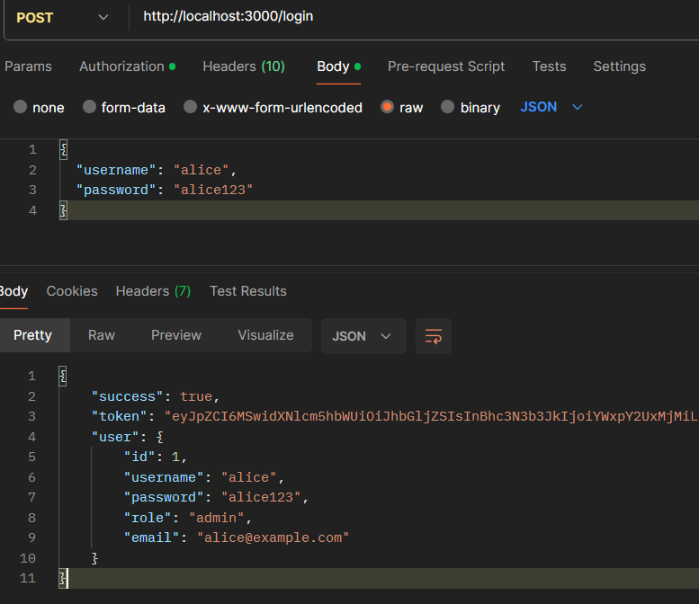
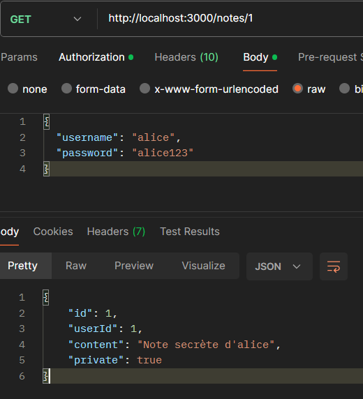
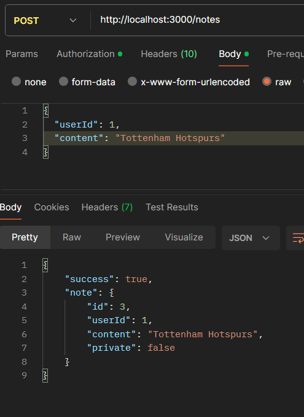
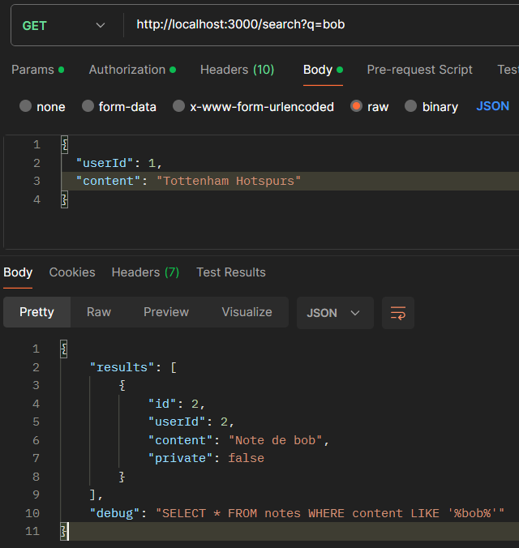
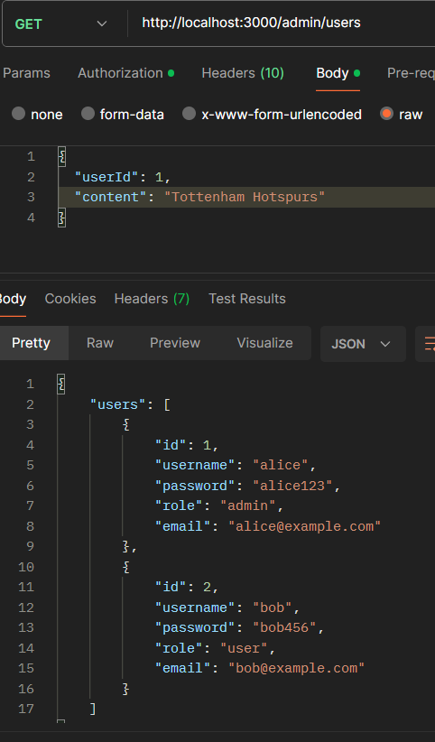
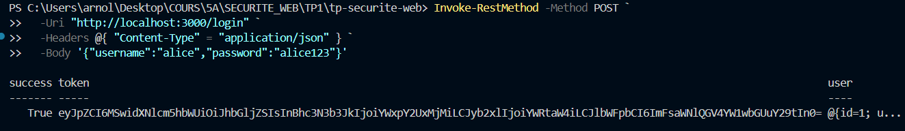
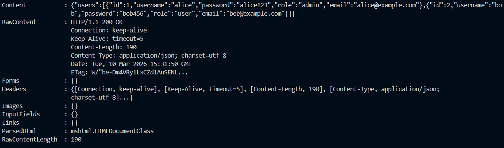
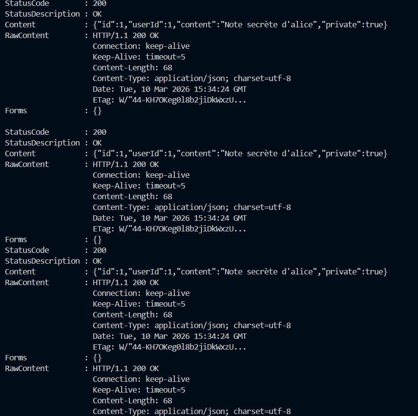
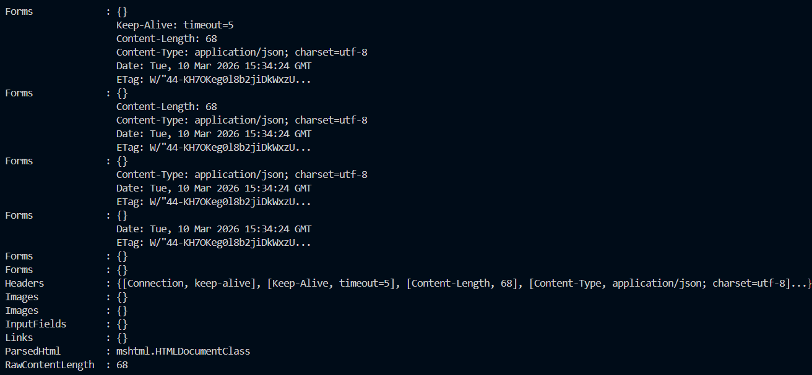
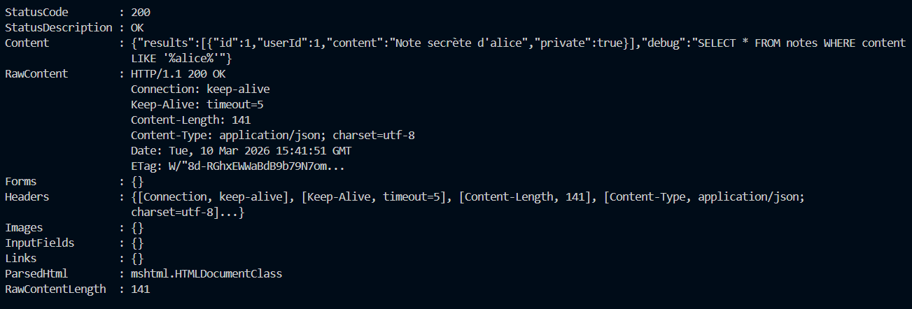

**Partie 2 : Audit de sécurité**

On peut voir ci-dessous que lorsque qu'on teste la route POST pour se connecter avec des identifiants corrects l'API nous renvoie un message de succès.

---

On peut voir ci-dessous que la méthode GET renvoie bien la note où l'id est égal à 1.

---

On peut voir ci-dessous qu'on peut ajouter des notes sous l'identité de qui l'on veut juste en mettant un userId existant.

---

On peut voir ici que cette requête donne en résultat une requête SQL en dur et également donne des informations sur bob, son id, ses notes, etc...

---

On peut voir ci-dessous que cette requête renvoie totus les users (admin + users) et leur informations personnelles (mot de passe, username, mail)

---

**Étape 2.1**

Une connexion normale réussie

--- 
---

Ici il y a le manque d'authentification, on voit ici que l'accès à la route admin est accessible à tous

---
---

Ici on peut voir grâce au requête que les notes privées des tous les utilisateurs.

---
---

Ici on peut voir qu'une requête est visible pour tous ce qui représente une faille dans le code.

---
---

**Partie 3**

